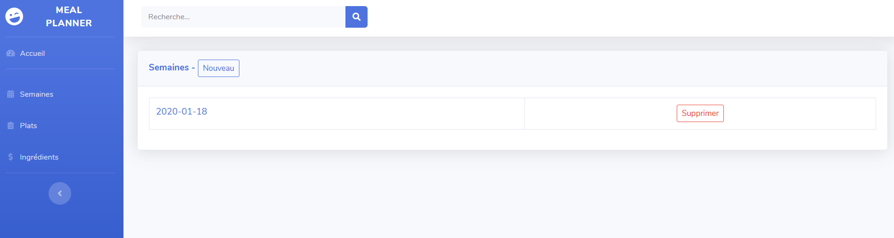
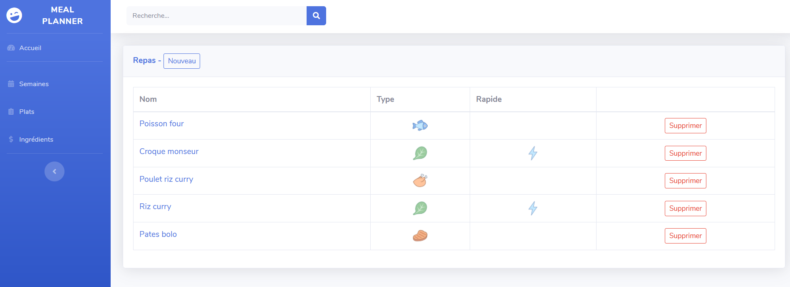
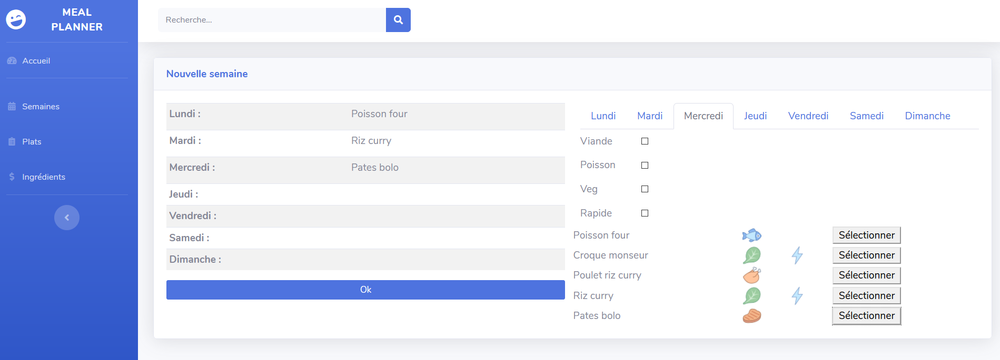

# MealPlanner

Petite application web pour m'aider à plannifier les repas de la semaine, le but étant de proposer des plats qui n'ont pas été déjà choisis la semaine passée.
Elle est codée en PHP et utilise une base de données mysql.

# Installation

J'ai effectué mes tests en utilisant wamp, téléchargeable sur le site officiel.

Après avoir "cloné" de dépôt et installé un environnement web comme wamp:
 - Installer les tables via le script `bdd/mealplanner.sql`
 - Modifier le script `mysql_connect.php` avec le couple login/mdp permettant la connexion à la base de données
 - Télécharger le moteur de template Smarty, et le copier à la racine tel que le chemin suivant existe : MealPlanner/smarty/Smarty.class.php

# Captures d'écran

